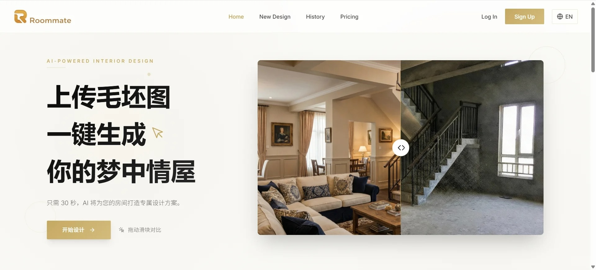
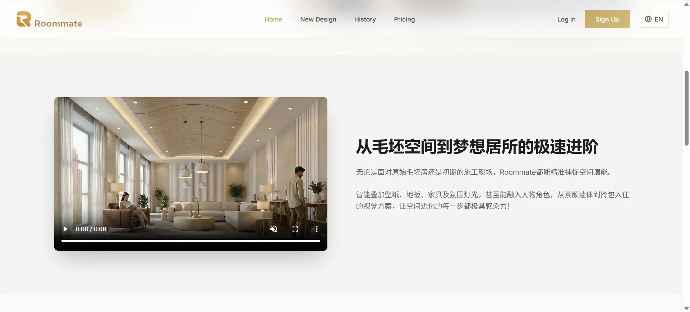

# AI 智能室内设计平台

> 基于 API易 Gemini API + Segmind SAM3 的智能装修设计与局部精修工具，内置评测平台

[](https://github.com/Frenkie99/Roommate-AI-interior)
[](https://github.com/Frenkie99/Roommate-AI-interior)
[](https://github.com/Frenkie99/Roommate-AI-interior)

## 🎬 功能演示

### 完整功能展示

<div align="center">
  
  <br/>
  
</div>

---

### 核心功能展示

| 功能 | 说明 |
|------|------|
| **🎨 智能生成** | 上传毛坯房照片，选择风格，一键生成精美装修效果图 |
| **✂️ 精准分割** | SAM3模型智能识别家具边界，支持框选局部区域 |
| **💬 对话精修** | 选中区域后，通过自然语言对话修改（"换沙发"、"改颜色"） |
| **📚 知识问答** | 内置RAG知识库，回答装修相关问题，提供专业建议 |
| **🎭 多风格支持** | 现代轻奢、新中式、北欧、工业风等10+种风格 |

### 实际效果示例

```
上传毛坯房照片 → 选择"现代轻奢"风格 → AI生成效果图 → 满意对话精修 → 下载高清图片
```

**生成效果特点：**
- ✅ 保持原有房间结构（窗户、墙体、层高完全一致）
- ✅ 专业级材质和光影效果
- ✅ 支持局部精细化修改
- ✅ 4K高清输出

**功能视频演示：**
> 如需查看完整功能演示，请克隆项目并本地运行

---

## 📊 评测平台

### 概述

内置 AI 效果图评测系统，支持批量生成、多维度评分、可视化分析。

### 评测流程

```
数据采集 → 手动筛选 → 批量生成 → 多维度评分 → 可视化分析
  (171张)    (85张)     (API调用)   (3个指标)    (Streamlit)
```

### 评测指标

| 指标 | 原理 | 意义 |
|------|------|------|
| **CLIP Score** | OpenAI CLIP 模型计算图像语义相似度 | 空间语义保留程度 |
| **Structural Fidelity** | Canny 边缘检测 + SSIM 结构相似度 | 承重结构、透视关系保持度 |
| **LLM Judge** | DeepSeek 基于风格/房间/提示词盲评 | 设计质量、风格准确性 |

### 评测结果（85 张样本）

| 指标 | 平均值 | 范围 |
|------|--------|------|
| CLIP Score | 0.85 | 0.76 – 0.93 |
| Structural Fidelity | 66.9 | 56.6 – 77.9 |
| LLM Judge | 3.79 | 3.0 – 5.0 |

### 运行评测

```bash
# 批量生成效果图
python -m evals.dataset.batch_generate

# 下载效果图到本地
python -m evals.dataset.download_outputs

# 运行评测
python -m evals.executor.runner

# 启动评测仪表盘
streamlit run evals/ui/app.py --server.port 8501
```

### 评测平台功能

- **概览**：指标卡片 + 分布图 + 标签统计
- **数据表**：可排序、可筛选的评测结果
- **图像对比**：毛坯原图 vs AI 效果图 + 评分详情
- **Badcase 分析**：最差/最佳表现案例复盘

---

## 📋 项目概述

本项目旨在开发一个AI驱动的装修效果图生成工具，用户只需上传毛坯房照片，即可自动生成精美的装修效果图。

### 核心功能

- **文本生成效果图**：输入房间描述，AI自动生成精美室内设计图
- **智能分割**：框选家具，SAM3自动识别物体边界
- **局部精修**：选中家具后通过对话修改（换风格、改颜色等）
- **风格选择**：支持多种装修风格（现代简约、北欧风、新中式、轻奢等）
- **高清下载**：支持生成图片下载保存

---

## 🏗️ 系统架构

```
┌─────────────────────────────────────────────────────────────────┐
│                         前端界面 (Frontend)                       │
│                    React 18 + Vite + TailwindCSS                 │
├─────────────────────────────────────────────────────────────────┤
│                              ↓ ↑                                 │
├─────────────────────────────────────────────────────────────────┤
│                        后端服务 (Backend)                         │
│                      Python FastAPI + Uvicorn                    │
│  ┌──────────────┐  ┌──────────────┐  ┌──────────────────────┐   │
│  │  图片生成服务  │  │  SAM3分割服务 │  │  局部编辑服务         │   │
│  │  (API易)      │  │  (Segmind)   │  │  (API易 Gemini)      │   │
│  └──────────────┘  └──────────────┘  └──────────────────────┘   │
├─────────────────────────────────────────────────────────────────┤
│                              ↓ ↑                                 │
├─────────────────────────────────────────────────────────────────┤
│                    API易 (apiyi.cn)                              │
│              Gemini Pro / Gemini Flash (图像生成)                  │
│                    Segmind (segmind.com)                         │
│              SAM3 (分割任意模型)                                   │
└─────────────────────────────────────────────────────────────────┘
```

---

## 📁 项目结构

```
AI-装修效果图生成器/
├── README.md                 # 项目说明文档
├── docs/                     # 文档目录
│   ├── api-reference.md      # API接口文档
│   └── user-guide.md         # 用户使用指南
│
├── frontend/                 # 前端项目
│   ├── public/               # 静态资源
│   ├── src/
│   │   ├── components/       # 组件
│   │   │   ├── ImageUploader.jsx    # 图片上传组件
│   │   │   ├── StyleSelector.jsx    # 风格选择组件
│   │   │   ├── ResultDisplay.jsx    # 结果展示组件
│   │   │   └── ProgressBar.jsx      # 进度条组件
│   │   ├── pages/            # 页面
│   │   │   └── Home.jsx      # 主页
│   │   ├── services/         # 服务层
│   │   │   └── api.js        # API调用封装
│   │   ├── styles/           # 样式文件
│   │   ├── App.jsx           # 应用入口
│   │   └── main.jsx          # 主入口
│   ├── package.json          # 依赖配置
│   └── vite.config.js        # Vite配置
│
├── backend/                  # 后端项目
│   ├── app/
│   │   ├── __init__.py
│   │   ├── main.py           # 应用入口
│   │   ├── routes/           # 路由
│   │   │   └── image.py      # 图片处理路由
│   │   ├── services/         # 服务层
│   │   │   ├── getgoapi_client.py # API易 Gemini 图像生成封装
│   │   │   ├── llm_client.py      # LLM 智能提示词（API易）
│   │   │   ├── sam_service.py     # Segmind SAM3 分割封装
│   │   │   ├── inpaint_service.py # 局部精修服务
│   │   │   ├── knowledge_service.py # RAG 知识问答
│   │   │   └── image_processor.py # 图片处理服务
│   │   ├── models/           # 数据模型
│   │   └── utils/            # 工具函数
│   ├── requirements.txt      # Python依赖
│   └── .env.example          # 环境变量示例
│
├── input/                    # 输入目录（毛坯房原图）
├── output/                   # 输出目录（生成的效果图）
│
├── evals/                    # 评测平台
│   ├── dataset/              # 数据集管理
│   │   ├── batch_generate.py     # 批量生成脚本
│   │   ├── download_outputs.py   # 下载效果图脚本
│   │   ├── batch_search.py       # Bing 图片搜索
│   │   ├── screener.py           # AI 图片筛选
│   │   ├── loader.py             # 数据加载器
│   │   └── schemas.py            # 数据模型
│   ├── scorer/               # 评分器
│   │   ├── clip_scorer.py        # CLIP 语义相似度
│   │   ├── structural_fidelity.py # 结构保真度
│   │   ├── llm_judge.py          # LLM 盲评
│   │   ├── fid_scorer.py         # FID 图像真实感
│   │   └── iou_scorer.py         # IoU 分割精度
│   ├── executor/             # 评测执行器
│   │   ├── runner.py             # 编排器
│   │   └── result_store.py       # 结果存储
│   ├── ui/                   # Streamlit 仪表盘
│   │   ├── app.py                # 入口
│   │   └── components/           # UI 组件
│   ├── config.py             # 全局配置
│   └── data/                 # 评测数据
│       ├── real_metadata.json    # 评测集元数据
│       └── eval_results.json     # 评测结果
│
└── assets/                   # 资源文件
    └── samples/              # 示例图片
```

---

## 🔄 业务流程

### 主流程

```
1. 用户上传毛坯房图片
        ↓
2. 前端校验图片格式和大小
        ↓
3. 图片上传至后端服务器
        ↓
4. 后端预处理图片（压缩、格式转换）
        ↓
5. 调用 API易 Gemini 图像生成 API
   - 传入原图
   - 传入装修风格参数
   - 传入生成提示词(Prompt)
        ↓
6. 等待AI生成结果
        ↓
7. 接收生成的效果图
        ↓
8. 返回结果至前端展示
        ↓
9. 用户预览/下载效果图
```

### 详细处理逻辑

```python
# 核心生成流程
def generate_renovation_image(original_image, style, room_type):
    # 1. 图片预处理（压缩、格式转换）
    processed_image = preprocess_image(original_image)
    
    # 2. 构建提示词（核心！）
    prompt = build_prompt(
        style=style,
        room_type=room_type,
        preserve_structure=True  # 保持原始房间结构
    )
    
    # 3. 调用 API易 Gemini 图像生成 API
    result = await getgoapi_client.generate_with_fallback(
        prompt=prompt,
        reference_image=processed_image,
        model_priority=[
            "gemini-3-pro-image-preview",
            "gemini-2.5-flash-image",
        ],
    )

    return result
```

---

## 🧠 提示词工程 (Prompt Engineering)

提示词工程是本项目的**核心技术**，决定了生成效果图的质量和准确性。

### 提示词构成

```
完整提示词 = 质量基础 + 结构保持 + 房间类型 + 装修风格 + 用户自定义
```

### 1. 结构识别与保持

**最重要的部分** - 确保AI保持原始毛坯房的空间结构：

```
Keep the exact same room structure, maintain original:
- Wall positions and angles (墙体位置和角度)
- Window locations, sizes and shapes (窗户位置、大小、形状)
- Door positions and openings (门的位置)
- Ceiling height and floor area (层高和面积)
- Room perspective and viewpoint (房间视角)
- Natural lighting direction (自然光方向)
```

### 2. 装修风格提示词

每个风格包含6个维度的描述：

| 维度 | 说明 | 示例（现代简约） |
|-----|------|----------------|
| core | 核心风格定义 | modern minimalist interior design |
| materials | 主要材质 | glass, polished concrete, minimal textures |
| colors | 色彩方案 | neutral palette, white, gray, beige |
| furniture | 家具特征 | clean-lined furniture, geometric shapes |
| atmosphere | 氛围感受 | open space, uncluttered, natural light |
| details | 细节装饰 | hidden storage, integrated lighting, plants |

### 3. 房间类型提示词

针对不同功能空间的专业描述：

| 维度 | 说明 |
|-----|------|
| space | 空间定义（如：spacious living room） |
| furniture | 标准家具配置 |
| features | 空间特征 |
| function | 功能用途 |

### 4. 质量控制提示词

```
professional interior design photograph
high resolution, 4K quality, sharp details
natural daylight, soft ambient lighting
wide angle lens, professional photography
octane render quality, ray tracing
```

### 5. 负面提示词

避免生成不需要的内容：

```
low quality, blurry, distorted, wrong perspective
cartoon, anime, illustration, watermark
human, person, people, animals
```

---

## 🎨 支持的装修风格

| 风格名称 | 英文标识 | 特点描述 |
|---------|---------|---------|
| 现代简约 | modern_minimalist | 线条简洁、色彩素雅、功能性强 |
| 北欧风格 | scandinavian | 清新自然、原木元素、明亮通透 |
| 新中式 | chinese_modern | 传统与现代融合、东方韵味 |
| 轻奢风格 | light_luxury | 精致细节、金属点缀、低调奢华 |
| 日式原木 | japanese_wood | 简约禅意、自然材质、温馨舒适 |
| 工业风 | industrial | 裸露砖墙、金属管道、复古元素 |
| 美式田园 | american_country | 温馨浪漫、柔和色调、自然元素 |
| 法式浪漫 | french_romantic | 精致优雅、浪漫氛围、古典元素 |
| 地中海 | mediterranean | 海洋蓝白、阳光温暖、自然质朴 |

---

## 🏠 支持的房间类型

| 房间类型 | 英文标识 | 说明 |
|---------|---------|------|
| 客厅 | living_room | 主要社交和休息空间 |
| 卧室 | bedroom | 私人休息空间 |
| 主卧 | master_bedroom | 主人套房 |
| 厨房 | kitchen | 烹饪空间 |
| 餐厅 | dining_room | 用餐空间 |
| 卫生间 | bathroom | 洗浴空间 |
| 书房 | study | 办公学习空间 |
| 儿童房 | kids_room | 儿童卧室 |
| 阳台 | balcony | 休闲空间 |
| 玄关 | entrance | 入户过渡空间 |

---

## 🔌 API 接口设计

> 当前接口为**同步实现**：请求会阻塞直到效果图生成完成（或失败），无需轮询 `task_id`。
> 完整接口文档见 [docs/api-reference.md](docs/api-reference.md)。

### 1. 生成效果图（同步）

```
POST /api/v1/generate
Content-Type: multipart/form-data
```

**请求参数:**

| 参数 | 类型 | 必填 | 描述 |
|-----|------|-----|------|
| image | File | 是 | 毛坯房图片(PNG/JPG，≤10MB) |
| style | String | 是 | 装修风格标识，见 `GET /api/v1/styles` |
| room_type | String | 否 | 房间类型，见 `GET /api/v1/room-types` |
| custom_prompt | String | 否 | 用户自定义补充提示词 |
| aspect_ratio | String | 否 | 输出比例：`auto` / `1:1` / `16:9` / `9:16` / `4:3` / `3:4`（默认 `auto`） |
| image_size | String | 否 | 输出尺寸：`1K` / `2K` / `4K`（默认 `1K`） |

**响应示例（成功）:**

```json
{
  "code": 0,
  "message": "success",
  "data": {
    "task_id": "abc12345",
    "status": "succeeded",
    "input_image": "20260101_120000_abc12345_input.jpg",
    "output_urls": ["/output/20260101_120000_abc12345_output_0.png"],
    "style": "modern_minimalist",
    "prompt": "<最终发给模型的提示词>",
    "used_model": "gemini-3-pro-image-preview",
    "llm_analysis": "<LLM 对毛坯房的结构识别结果>",
    "llm_enabled": true
  }
}
```

**响应示例（失败）:**

```json
{
  "code": -1,
  "message": "<错误描述>",
  "data": null
}
```

### 2. 辅助接口

| 接口 | 说明 |
|------|------|
| `GET /api/v1/styles` | 列出所有支持的装修风格 |
| `GET /api/v1/room-types` | 列出所有支持的房间类型 |
| `GET /api/v1/models` | 列出当前可用的 Gemini 图像模型 |
| `POST /api/v1/segment/box` | SAM3 框选分割（局部精修） |
| `POST /api/v1/inpaint` | 选区局部重绘 |
| `POST /api/v1/knowledge/ask` | RAG 装修知识问答 |

---

## 🛠️ 技术栈

### 前端
- **框架**: React 18 + Vite
- **UI**: TailwindCSS + Framer Motion
- **组件**: Lucide Icons + React Dropzone

### 后端
- **框架**: Python FastAPI + Uvicorn
- **AI**: API易 Gemini + Segmind SAM3 + DeepSeek RAG
- **向量库**: Chroma + 21条装修知识

### 外部服务
- **AI生成**: API易平台 Gemini Flash
- **图像分割**: Segmind SAM3
- **知识问答**: DeepSeek V3 (RAG)

---

## 🚀 快速体验

### 本地运行（推荐）

```bash
# 克隆项目
git clone https://github.com/Frenkie99/Roommate-AI-interior.git
cd Roommate-AI-interior

# 启动后端
cd backend
pip install -r requirements.txt
python -m uvicorn app.main:app --port 8000

# 启动前端（新终端）
cd frontend
npm install
npm run dev
```

访问 http://localhost:5173 即可使用完整功能！

---

## 📸 添加您的截图

如果您想展示自己的项目截图：

1. 运行项目并截图界面
2. 将截图保存到 `frontend/public/screenshots/` 目录
3. 在README中添加：
   ```markdown
   <div align="center">
     
   </div>
   ```

---

## 🚀 快速开始

### 环境要求

- Node.js >= 18.0
- Python >= 3.10
- API易 平台 API Key（用于 Gemini 图像生成 + LLM 提示词分析）
- Segmind API Key（用于 SAM3 分割）

### 安装步骤

```bash
# 1. 克隆项目
git clone <repository-url>
cd Roommate-AI-interior

# 2. 安装前端依赖
cd frontend
npm install

# 3. 安装后端依赖
cd ../backend
pip install -r requirements.txt

# 4. 配置环境变量
cp .env.example .env
# 编辑 .env 文件，填入 APIYI_KEY / LLM_APIYI_KEY / SEGMIND_API_KEY

# 5. 启动后端服务
python -m uvicorn app.main:app --reload --port 8000

# 6. 启动前端服务
cd ../frontend
npm run dev
```

---

## ⚙️ 环境变量配置

> 环境变量的**单一来源**为 [`backend/.env.example`](backend/.env.example)。
> 部署时复制为 `backend/.env` 并填入真实值，**不要把 `.env` 提交到 Git**。

下表列出当前代码实际读取（`os.getenv`）的关键变量：

| 变量名 | 必填 | 用途 | 读取位置 |
|--------|------|------|----------|
| `APIYI_KEY` | 是 | API易 Gemini 图像生成 API Key | `services/getgoapi_client.py`, `services/inpaint_service.py` |
| `LLM_APIYI_KEY` | 是 | API易 LLM 智能提示词分析 Key（可与 `APIYI_KEY` 同值） | `services/llm_client.py` |
| `SEGMIND_API_KEY` | 是 | Segmind SAM3 分割 API Key | `services/sam_service.py` |
| `USE_LLM_PROMPT` | 否 | 是否启用 LLM 提示词增强（默认 `true`） | `routes/image.py`, `main.py` |
| `SERVER_PORT` | 否 | 后端端口（默认 `8000`） | 启动脚本 |
| `FRONTEND_URL` | 否 | 前端地址（用于 CORS） | `main.py` |
| `BASE_URL` | 否 | 后端外部访问 URL（用于拼接 output 图片链接） | `routes/segment.py` |
| `INPUT_DIR` / `OUTPUT_DIR` | 否 | 上传/输出目录 | `routes/image.py`, `routes/segment.py` |
| `MAX_FILE_SIZE` | 否 | 上传体积上限（字节，默认 10MB） | 上传校验 |

完整模板请见 [`backend/.env.example`](backend/.env.example)。

---

## 🔌 支持的模型

图像生成走 API易（apiyi.com）的 Gemini 多模态系列，代码内置**自动降级**机制：优先调用 Pro，失败时回退到 Flash。模型清单见 [`backend/app/services/getgoapi_client.py`](backend/app/services/getgoapi_client.py) 中的 `GetGoModel` 枚举。

| 模型 ID | 用途 | 说明 |
|---------|------|------|
| `gemini-3-pro-image-preview` | 默认首选 | 质量最高，支持 1K / 2K / 4K 输出 |
| `gemini-2.5-flash-image` | 自动降级 | 速度更快，作为 Pro 失败时的兜底 |
| `gemini-2.5-flash-image-preview` | 备用 | Flash 系列预览版本 |

> 不再使用 `nano-banana` 系列。历史文档中如有遗留，以本节为准。

辅助模型：

- **分割**：Segmind SAM3（`services/sam_service.py`）
- **提示词分析 / 知识问答**：API易 LLM 通道 + DeepSeek V3（RAG）

---

## 📄 License

MIT License

---

## 👥 联系方式

如有问题或建议，欢迎提交 Issue 或 Pull Request。
