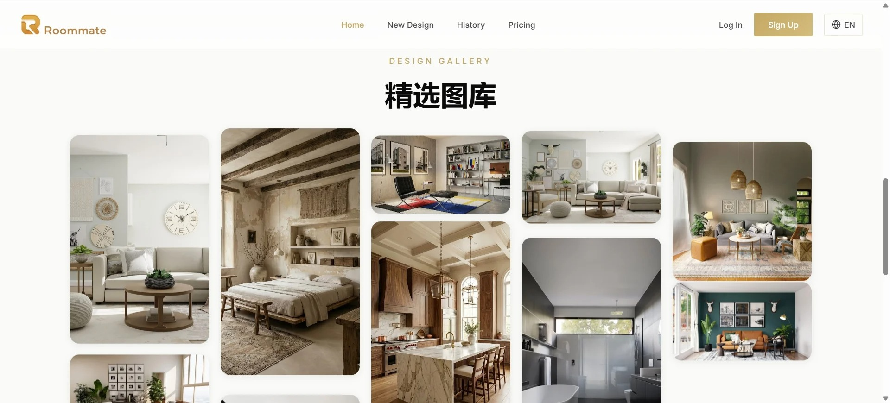
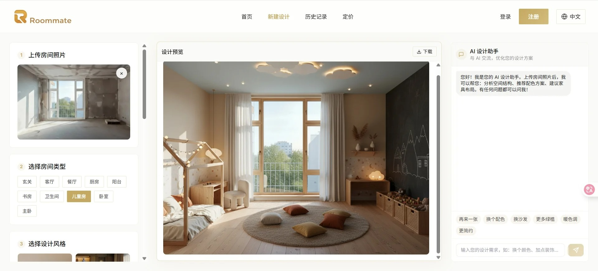

# AI 智能室内设计平台

> 基于 API易 Gemini API + Segmind SAM3 的智能装修设计与局部精修工具

[](https://github.com/Frenkie99/Roommate-AI-interior)
[](https://github.com/Frenkie99/Roommate-AI-interior)
[](https://github.com/Frenkie99/Roommate-AI-interior)

## 🎬 功能演示

### 完整功能展示

<div align="center">
  
  <br/>
  
  <br/>
  
  <br/>
  
</div>

---

### 核心功能展示

| 功能 | 说明 |
|------|------|
| **🎨 智能生成** | 上传毛坯房照片，选择风格，一键生成精美装修效果图 |
| **✂️ 精准分割** | SAM3模型智能识别家具边界，支持框选局部区域 |
| **💬 对话精修** | 选中区域后，通过自然语言对话修改（"换沙发"、"改颜色"） |
| **📚 知识问答** | 内置RAG知识库，回答装修相关问题，提供专业建议 |
| **🎭 多风格支持** | 现代轻奢、新中式、北欧、工业风等10+种风格 |

### 实际效果示例

```
上传毛坯房照片 → 选择"现代轻奢"风格 → AI生成效果图 → 满意对话精修 → 下载高清图片
```

**生成效果特点：**
- ✅ 保持原有房间结构（窗户、墙体、层高完全一致）
- ✅ 专业级材质和光影效果
- ✅ 支持局部精细化修改
- ✅ 4K高清输出

**功能视频演示：**
> 如需查看完整功能演示，请克隆项目并本地运行

---

## 📋 项目概述

本项目旨在开发一个AI驱动的装修效果图生成工具，用户只需上传毛坯房照片，即可自动生成精美的装修效果图。

### 核心功能

- **文本生成效果图**：输入房间描述，AI自动生成精美室内设计图
- **智能分割**：框选家具，SAM3自动识别物体边界
- **局部精修**：选中家具后通过对话修改（换风格、改颜色等）
- **风格选择**：支持多种装修风格（现代简约、北欧风、新中式、轻奢等）
- **高清下载**：支持生成图片下载保存

---

## 🏗️ 系统架构

```
┌─────────────────────────────────────────────────────────────────┐
│                         前端界面 (Frontend)                       │
│                    React 18 + Vite + TailwindCSS                 │
├─────────────────────────────────────────────────────────────────┤
│                              ↓ ↑                                 │
├─────────────────────────────────────────────────────────────────┤
│                        后端服务 (Backend)                         │
│                      Python FastAPI + Uvicorn                    │
│  ┌──────────────┐  ┌──────────────┐  ┌──────────────────────┐   │
│  │  图片生成服务  │  │  SAM3分割服务 │  │  局部编辑服务         │   │
│  │  (API易)      │  │  (Segmind)   │  │  (API易 Gemini)      │   │
│  └──────────────┘  └──────────────┘  └──────────────────────┘   │
├─────────────────────────────────────────────────────────────────┤
│                              ↓ ↑                                 │
├─────────────────────────────────────────────────────────────────┤
│                    API易 (apiyi.cn)                              │
│              Gemini Pro / Gemini Flash (图像生成)                  │
│                    Segmind (segmind.com)                         │
│              SAM3 (分割任意模型)                                   │
└─────────────────────────────────────────────────────────────────┘
```

---

## 📁 项目结构

```
AI-装修效果图生成器/
├── README.md                 # 项目说明文档
├── docs/                     # 文档目录
│   ├── api-reference.md      # API接口文档
│   └── user-guide.md         # 用户使用指南
│
├── frontend/                 # 前端项目
│   ├── public/               # 静态资源
│   ├── src/
│   │   ├── components/       # 组件
│   │   │   ├── ImageUploader.jsx    # 图片上传组件
│   │   │   ├── StyleSelector.jsx    # 风格选择组件
│   │   │   ├── ResultDisplay.jsx    # 结果展示组件
│   │   │   └── ProgressBar.jsx      # 进度条组件
│   │   ├── pages/            # 页面
│   │   │   └── Home.jsx      # 主页
│   │   ├── services/         # 服务层
│   │   │   └── api.js        # API调用封装
│   │   ├── styles/           # 样式文件
│   │   ├── App.jsx           # 应用入口
│   │   └── main.jsx          # 主入口
│   ├── package.json          # 依赖配置
│   └── vite.config.js        # Vite配置
│
├── backend/                  # 后端项目
│   ├── app/
│   │   ├── __init__.py
│   │   ├── main.py           # 应用入口
│   │   ├── routes/           # 路由
│   │   │   └── image.py      # 图片处理路由
│   │   ├── services/         # 服务层
│   │   │   ├── nano_banana.py    # Nano Banana API封装
│   │   │   └── image_processor.py # 图片处理服务
│   │   ├── models/           # 数据模型
│   │   └── utils/            # 工具函数
│   ├── requirements.txt      # Python依赖
│   └── .env.example          # 环境变量示例
│
├── input/                    # 输入目录（毛坯房原图）
├── output/                   # 输出目录（生成的效果图）
│
└── assets/                   # 资源文件
    └── samples/              # 示例图片
```

---

## 🔄 业务流程

### 主流程

```
1. 用户上传毛坯房图片
        ↓
2. 前端校验图片格式和大小
        ↓
3. 图片上传至后端服务器
        ↓
4. 后端预处理图片（压缩、格式转换）
        ↓
5. 调用 Nano Banana Pro API
   - 传入原图
   - 传入装修风格参数
   - 传入生成提示词(Prompt)
        ↓
6. 等待AI生成结果
        ↓
7. 接收生成的效果图
        ↓
8. 返回结果至前端展示
        ↓
9. 用户预览/下载效果图
```

### 详细处理逻辑

```python
# 核心生成流程
def generate_renovation_image(original_image, style, room_type):
    # 1. 图片预处理（压缩、格式转换）
    processed_image = preprocess_image(original_image)
    
    # 2. 构建提示词（核心！）
    prompt = build_prompt(
        style=style,
        room_type=room_type,
        preserve_structure=True  # 保持原始房间结构
    )
    
    # 3. 调用 Grsai Nano Banana API
    result = nano_banana_api.generate(
        image=processed_image,
        prompt=prompt,
        model="nano-banana"
    )
    
    return result
```

---

## 🧠 提示词工程 (Prompt Engineering)

提示词工程是本项目的**核心技术**，决定了生成效果图的质量和准确性。

### 提示词构成

```
完整提示词 = 质量基础 + 结构保持 + 房间类型 + 装修风格 + 用户自定义
```

### 1. 结构识别与保持

**最重要的部分** - 确保AI保持原始毛坯房的空间结构：

```
Keep the exact same room structure, maintain original:
- Wall positions and angles (墙体位置和角度)
- Window locations, sizes and shapes (窗户位置、大小、形状)
- Door positions and openings (门的位置)
- Ceiling height and floor area (层高和面积)
- Room perspective and viewpoint (房间视角)
- Natural lighting direction (自然光方向)
```

### 2. 装修风格提示词

每个风格包含6个维度的描述：

| 维度 | 说明 | 示例（现代简约） |
|-----|------|----------------|
| core | 核心风格定义 | modern minimalist interior design |
| materials | 主要材质 | glass, polished concrete, minimal textures |
| colors | 色彩方案 | neutral palette, white, gray, beige |
| furniture | 家具特征 | clean-lined furniture, geometric shapes |
| atmosphere | 氛围感受 | open space, uncluttered, natural light |
| details | 细节装饰 | hidden storage, integrated lighting, plants |

### 3. 房间类型提示词

针对不同功能空间的专业描述：

| 维度 | 说明 |
|-----|------|
| space | 空间定义（如：spacious living room） |
| furniture | 标准家具配置 |
| features | 空间特征 |
| function | 功能用途 |

### 4. 质量控制提示词

```
professional interior design photograph
high resolution, 4K quality, sharp details
natural daylight, soft ambient lighting
wide angle lens, professional photography
octane render quality, ray tracing
```

### 5. 负面提示词

避免生成不需要的内容：

```
low quality, blurry, distorted, wrong perspective
cartoon, anime, illustration, watermark
human, person, people, animals
```

---

## 🎨 支持的装修风格

| 风格名称 | 英文标识 | 特点描述 |
|---------|---------|---------|
| 现代简约 | modern_minimalist | 线条简洁、色彩素雅、功能性强 |
| 北欧风格 | scandinavian | 清新自然、原木元素、明亮通透 |
| 新中式 | chinese_modern | 传统与现代融合、东方韵味 |
| 轻奢风格 | light_luxury | 精致细节、金属点缀、低调奢华 |
| 日式原木 | japanese_wood | 简约禅意、自然材质、温馨舒适 |
| 工业风 | industrial | 裸露砖墙、金属管道、复古元素 |
| 美式田园 | american_country | 温馨浪漫、柔和色调、自然元素 |
| 法式浪漫 | french_romantic | 精致优雅、浪漫氛围、古典元素 |
| 地中海 | mediterranean | 海洋蓝白、阳光温暖、自然质朴 |

---

## 🏠 支持的房间类型

| 房间类型 | 英文标识 | 说明 |
|---------|---------|------|
| 客厅 | living_room | 主要社交和休息空间 |
| 卧室 | bedroom | 私人休息空间 |
| 主卧 | master_bedroom | 主人套房 |
| 厨房 | kitchen | 烹饪空间 |
| 餐厅 | dining_room | 用餐空间 |
| 卫生间 | bathroom | 洗浴空间 |
| 书房 | study | 办公学习空间 |
| 儿童房 | kids_room | 儿童卧室 |
| 阳台 | balcony | 休闲空间 |
| 玄关 | entrance | 入户过渡空间 |

---

## 🔌 API 接口设计

### 1. 图片上传并生成效果图

```
POST /api/v1/generate
```

**请求参数:**

| 参数 | 类型 | 必填 | 描述 |
|-----|------|-----|------|
| image | File | 是 | 毛坯房图片文件(PNG/JPG) |
| style | String | 是 | 装修风格标识 |
| room_type | String | 否 | 房间类型(客厅/卧室/厨房等) |
| custom_prompt | String | 否 | 自定义提示词 |

**响应示例:**

```json
{
  "code": 200,
  "message": "success",
  "data": {
    "task_id": "abc123",
    "status": "processing",
    "estimated_time": 30
  }
}
```

### 2. 查询生成状态

```
GET /api/v1/task/{task_id}
```

**响应示例:**

```json
{
  "code": 200,
  "data": {
    "task_id": "abc123",
    "status": "completed",
    "result_url": "https://xxx.com/result/abc123.png",
    "created_at": "2025-01-19T16:00:00Z"
  }
}
```

---

## 🛠️ 技术栈

### 前端
- **框架**: React 18 + Vite
- **UI**: TailwindCSS + Framer Motion
- **组件**: Lucide Icons + React Dropzone

### 后端
- **框架**: Python FastAPI + Uvicorn
- **AI**: API易 Gemini + Segmind SAM3 + DeepSeek RAG
- **向量库**: Chroma + 21条装修知识

### 外部服务
- **AI生成**: API易平台 Gemini Flash
- **图像分割**: Segmind SAM3
- **知识问答**: DeepSeek V3 (RAG)

---

## 🚀 快速体验

### 本地运行（推荐）

```bash
# 克隆项目
git clone https://github.com/Frenkie99/Roommate-AI-interior.git
cd Roommate-AI-interior

# 启动后端
cd backend
pip install -r requirements.txt
python -m uvicorn app.main:app --port 8000

# 启动前端（新终端）
cd frontend
npm install
npm run dev
```

访问 http://localhost:5173 即可使用完整功能！

---

## 📸 添加您的截图

如果您想展示自己的项目截图：

1. 运行项目并截图界面
2. 将截图保存到 `frontend/public/screenshots/` 目录
3. 在README中添加：
   ```markdown
   <div align="center">
     
   </div>
   ```

---

## 🚀 快速开始

### 环境要求

- Node.js >= 18.0
- Python >= 3.10
- Nano Banana Pro API Key

### 安装步骤

```bash
# 1. 克隆项目
git clone <repository-url>
cd AI-装修效果图生成器

# 2. 安装前端依赖
cd frontend
npm install

# 3. 安装后端依赖
cd ../backend
pip install -r requirements.txt

# 4. 配置环境变量
cp .env.example .env
# 编辑 .env 文件，填入 Nano Banana Pro API Key

# 5. 启动后端服务
python -m uvicorn app.main:app --reload --port 8000

# 6. 启动前端服务
cd ../frontend
npm run dev
```

---

## 📝 开发计划

### Phase 1: 基础功能 (MVP)
- [ ] 搭建前后端项目框架
- [ ] 实现图片上传功能
- [ ] 集成 Nano Banana Pro API
- [ ] 实现基础效果图生成
- [ ] 效果图预览和下载

### Phase 2: 功能增强
- [ ] 多种装修风格支持
- [ ] 房间类型识别
- [ ] 批量生成功能
- [ ] 历史记录管理

### Phase 3: 体验优化
- [ ] 生成进度实时展示
- [ ] 结果对比功能(Before/After)
- [ ] 局部重新生成
- [ ] 用户反馈收集

### Phase 4: 商业化
- [ ] 用户账户系统
- [ ] 付费功能模块
- [ ] 高级风格定制
- [ ] API开放平台

---

## ⚙️ 环境变量配置

```env
# Grsai Nano Banana API 配置
# 在 https://grsaiapi.com 获取API Key
GRSAI_API_KEY=your_api_key_here

# API地址（二选一）
# 海外: https://grsaiapi.com
# 国内直连: https://grsai.dakka.com.cn
GRSAI_API_URL=https://grsai.dakka.com.cn

# 默认模型: nano-banana, nano-banana-fast, nano-banana-pro 等
DEFAULT_MODEL=nano-banana

# 服务配置
SERVER_PORT=8000
FRONTEND_URL=http://localhost:5173

# 存储配置
INPUT_DIR=./input
OUTPUT_DIR=./output
MAX_FILE_SIZE=10485760  # 10MB
```

---

## 🔌 支持的模型

| 模型ID | 名称 | 说明 |
|-------|------|------|
| nano-banana-fast | 快速版 | 生成速度快，适合预览 |
| nano-banana | 标准版 | 平衡速度和质量（推荐） |
| nano-banana-pro | 专业版 | 更高质量，支持1K/2K/4K |
| nano-banana-pro-vt | 专业增强版 | 视觉增强 |
| nano-banana-pro-cl | 色彩增强版 | 色彩更丰富 |
| nano-banana-pro-vip | VIP版 | 支持1K/2K |
| nano-banana-pro-4k-vip | 4K VIP版 | 4K超高清 |

---

## 📄 License

MIT License

---

## 👥 联系方式

如有问题或建议，欢迎提交 Issue 或 Pull Request。
